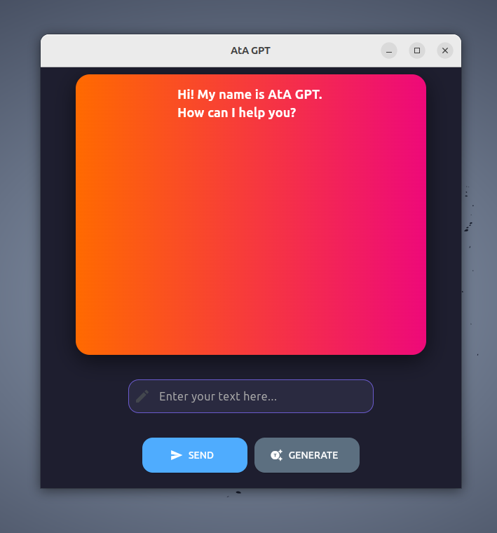

# Flet OpenAI Chat App

A Python application built with **Flet** that allows users to chat with OpenAI models using a token-based system.

## Features
- Built with Python + Flet
- OpenAI API integration
- Token-based access
- Desktop/Web compatible UI

## Requirements
- Python 3.9+
- flet
- openai

## Setup
1. Clone the repo
2. Create a `.env` file
3. Add:
   write your api key in API_KEY.py
4. Run:
   python GpT.py

